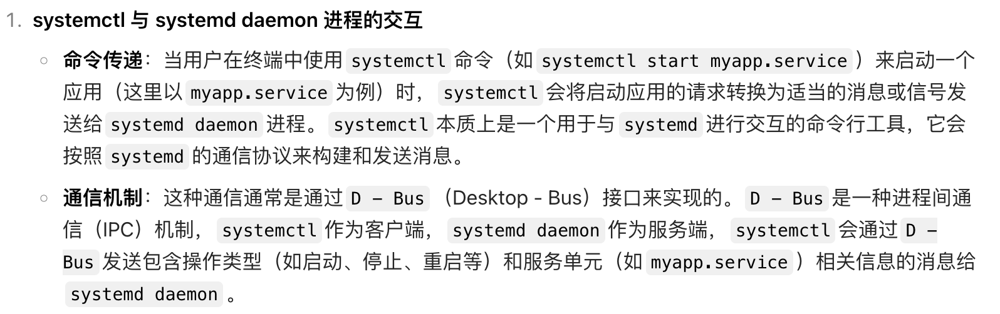
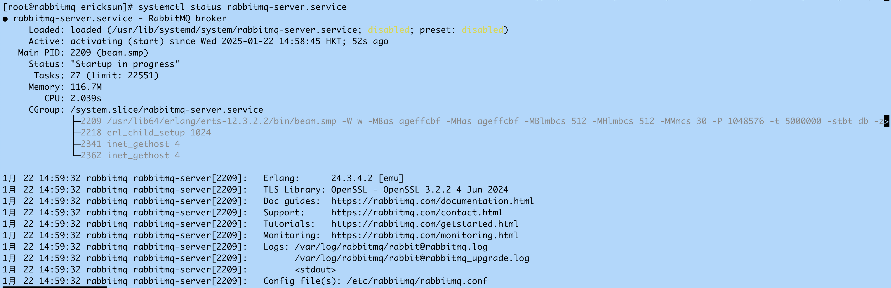
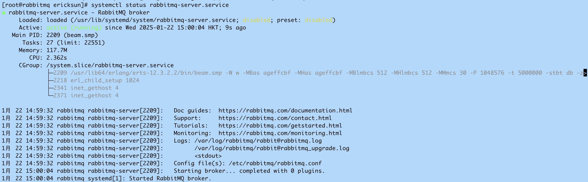
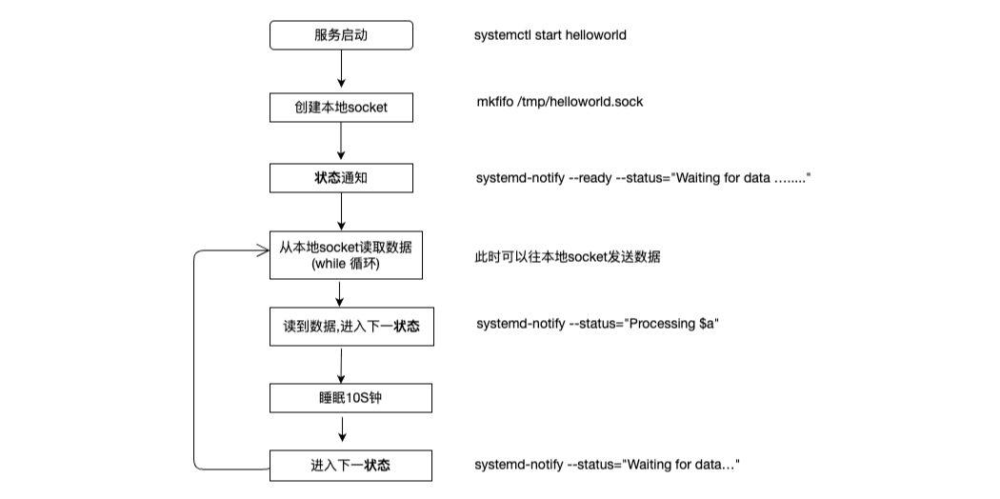

# RabbitMQ 启动方式与 Systemd 集成详解

## 目标

**以 RabbitMQ version: 3.9.21 版本为例**

- **systemd 的使用方式(shell、c、python、erlang)**
- **RabbitMQ 的启动方式**
- **systemd 库的源码分析**
- **RabbitMQ 的启动脚本**

```bash
export ERL_LIBS=/usr/lib/rabbitmq/lib/rabbitmq_server-3.9.21/plugins

ERL_LIBS=/usr/lib/rabbitmq/lib/rabbitmq_server-3.9.21/plugins erl -noinput -s rabbit boot -boot start_sasl
```





---

## systemd 相关术语

### 术语解释

| **术语** | **英文对照** | **备注** |
|----------|--------------|----------|
| **应用程序** | service script(App) | |
| **服务名** | service | |
| **服务管理器** | systemd | 系统和服务管理器 |
| **服务管理命令** | systemctl | 与 systemd 进行交互的接口 |

应用程序启动一般需要一定的启动时间才能初始化完毕，初始化完毕的时候可以通过某种方式通知服务管理器。

`systemd-notify` 就是用来向服务管理器(systemd)**通知启动完成**及其他守护进程状态变化。

`systemd-notify` 是 `sd_notify()` 函数的一个包装，使得 shell 脚本也能使用此功能。


### 实例演示

| **术语** | **英文对照** | **备注** |
|----------|--------------|----------|
| **应用程序** | service script(App) | helloworld.sh |
| **服务名** | service name | helloworld.service |
| **服务管理器** | systemd | 系统和服务管理器 |
| **服务管理命令** | systemctl | 与 systemd 进行交互的接口 |


**示例代码：** https://github.com/hzsunzixiang/rabbitmq-server-debug/tree/main/book/systemd

#### 应用程序 (helloworld.sh)

```bash
#!/bin/bash

systemd-notify --ready --status="Waiting for data ..."

while : ; do
    echo "...NOTIFY_SOCKET:[ $NOTIFY_SOCKET ]..." > /tmp/notify.txt
    systemd-notify --status="do something hello..."
    # Do something with
    sleep 10
    systemd-notify --status="do something world..."
done
```

#### Service 配置 (helloworld.service)

```ini
[Unit]
Description=HelloWorld Service

[Service]
Type=notify
ExecStart=/usr/local/bin/helloworld.sh

[Install]
WantedBy=multi-user.target
```

#### 流程演示

```bash
systemctl start helloworld
echo "helloworld" > /tmp/helloworld
systemctl status helloworld
```

---

## C 语言中的 systemd

示例代码：https://github.com/hzsunzixiang/rabbitmq-server-debug/tree/main/book/systemd/clang_systemd

---

## Python 中的 systemd

示例代码：https://github.com/hzsunzixiang/rabbitmq-server-debug/tree/main/book/systemd/python_systemd

---

## Erlang 中的 systemd

**注意：** 需要设置 `NotifyAccess=all`

### 启动示例

```erlang
application:ensure_all_started(systemd).
{ok,[enough,systemd]}
```

或者从 `rebar.config` 中配置依赖：

```erlang
{deps, [enough]}.
```

### erlang-systemd 库特点

erlang-systemd 是一个 Erlang 库，用于在 Erlang 应用程序中集成 systemd。主要特点包括：

1. 支持 systemd 的所有通知类型，包括 READY、STATUS、WATCHDOG 等
2. 支持 systemd 的所有进程管理功能，包括启动、停止、重启、暂停、恢复等
3. 支持 systemd 的所有 unit 管理功能，包括注册、卸载、状态查询等
4. 支持 systemd 的所有进程间通信功能，包括 socket 激活、文件描述符传递等
5. 提供了一组方便的宏和函数，简化与 systemd 的交互过程

### Socket 处理代码

```erlang
os:putenv("NOTIFY_SOCKET", "/run/systemd/notify").
os:getenv("NOTIFY_SOCKET")

notify_socket() ->
    State =
        case os:getenv(?NOTIFY_SOCKET) of
            false ->
                [];
            [$@ | AbstractPath] ->
                [0 | AbstractPath];
            Path ->
                case file:read_file_info(Path) of
                    {error, _Error} ->
                        [];
                    {ok, #file_info{access = Access}} when
                        Access =:= write; Access =:= read_write
                    ->
                        Path
                end
        end,
    unset(notify),
    State.
```


### 关于 READY 通知的重要说明

**如果不发送 READY 通知会怎样？**

如果应用程序没有向 systemd 发送 READY 通知，systemd 会默认认为应用程序已经准备就绪，并开始接收请求。这种情况下，systemd 不会等待应用程序发送 READY 通知，而是直接将该进程标记为已就绪状态。

**使用 Type=notify 的情况：**

如果应用程序没有 READY 通知机制，可以使用 systemd 的 `Type=notify` 选项，以便 systemd 等待应用程序发送 READY 通知。在这种情况下，systemd 会在启动应用程序时，将一条文件描述符（socket）传递给应用程序，应用程序可以使用该文件描述符向 systemd 发送 READY 通知。如果应用程序不发送 READY 通知，systemd 会超时并将该进程标记为启动失败。

---

## systemd 在 RabbitMQ 启动中的具体作用


### 安装 RabbitMQ

#### 配置 yum 源

```bash
cat /etc/yum.repos.d/CentOS-Messaging-rabbitmq.repo
```

```ini
[centos-rabbitmq-38]
name=CentOS-9 - RabbitMQ 38
metalink=https://mirrors.centos.org/metalink?repo=centos-messaging-sig-rabbitmq-38-$releasever-stream&arch=$basearch&protocol=https,http
gpgcheck=1
enabled=1
gpgkey=file:///etc/pki/rpm-gpg/RPM-GPG-KEY-CentOS-SIG-Messaging
```

#### 安装命令

```bash
# 安装 yum 源
yum install centos-release-rabbitmq-38.noarch

# 安装 rabbitmq
yum install rabbitmq-server.aarch64
```

#### 设置日志级别

在 `/etc/rabbitmq/rabbitmq.conf` 中添加：

```ini
log.file.level = debug
```






### 特别注意：域名配置

```bash
cat /etc/hosts
```

```
127.0.0.1   localhost localhost.localdomain localhost4 localhost4.localdomain4
::1         localhost localhost.localdomain localhost6 localhost6.localdomain6
127.0.0.1   rabbitmq
172.16.117.156  rabbitmq
```

**如果域名配置不正确，会出现以下错误：**

```bash
rabbitmq-plugins enable rabbitmq_management
# {:query, :rabbit@rabbitmq, {:badrpc, :timeout}}

rabbitmqctl status
# Error: unable to perform an operation on node 'rabbit@rabbitmq'.
```

### RabbitMQ Service 配置文件

```ini
# systemd unit example
[Unit]
Description=RabbitMQ broker
After=network.target epmd@0.0.0.0.socket
Wants=network.target epmd@0.0.0.0.socket

[Service]
# 安全加固选项（可选）
# ProtectSystem=full
# ProtectHome=true
# PrivateDevices=true
# ProtectHostname=true
# ProtectClock=true
# ProtectKernelTunables=true
# ProtectKernelModules=true
# ProtectKernelLogs=true
# ProtectControlGroups=true
# RestrictRealtime=true

Type=notify
User=rabbitmq
Group=rabbitmq
NotifyAccess=all
TimeoutStartSec=3600

# 自动重启配置（可选）
# Restart=on-failure
# RestartSec=10

WorkingDirectory=/var/lib/rabbitmq
ExecStart=/usr/lib/rabbitmq/bin/rabbitmq-server
ExecStop=/usr/lib/rabbitmq/bin/rabbitmqctl stop
ExecStop=/bin/sh -c "while ps -p $MAINPID >/dev/null 2>&1; do sleep 1; done"

[Install]
WantedBy=multi-user.target
```

### 启动状态示例

```bash
systemctl status rabbitmq-server
```

输出：

```
● rabbitmq-server.service - RabbitMQ broker
   Loaded: loaded (/etc/systemd/system/rabbitmq-server.service; disabled; preset: disabled)
   Active: active (running) since Sat 2025-01-04 01:10:28 EST; 39s ago
 Main PID: 164224 (beam.smp)
    Tasks: 27 (limit: 22563)
   Memory: 124.8M
      CPU: 5.890s
   CGroup: /system.slice/rabbitmq-server.service
           ├─164224 /usr/local/lib/erlang/erts-14.2.5.1/bin/beam.smp ...
           ├─164235 erl_child_setup 1024
           ├─164294 /usr/local/lib/erlang/erts-14.2.5.1/bin/inet_gethost 4
           └─164295 /usr/local/lib/erlang/erts-14.2.5.1/bin/inet_gethost 4
```


### 环境变量说明

```
NOTIFY_SOCKET:/run/systemd/notify
RABBITMQ_ALLOW_INPUT:, RUNNING_UNDER_SYSTEMD:true detached:
```


### 启动状态日志

```bash
grep "Change boot state to" /var/log/rabbitmq/*
```

输出：

```
/var/log/rabbitmq/rabbit@rabbitmq.log:2025-01-04 07:59:46.747822-05:00 [debug] <0.237.0> Change boot state to `core_started`
/var/log/rabbitmq/rabbit@rabbitmq.log:2025-01-04 07:59:46.898118-05:00 [debug] <0.477.0> Change boot state to `ready`
```

### systemd 状态通知日志

```
2025-01-22 14:20:19.415916+08:00 [debug] <0.132.0> Boot state/systemd: sending non-systemd state (stopped) as status description: "Standing by"
2025-01-22 14:59:40.525333+08:00 [debug] <0.132.0> Boot state/systemd: sending non-systemd state (core_started) as status description: "Startup in progress (core ready, starting plugins)"
2025-01-22 15:18:50.174236+08:00 [debug] <0.132.0> Boot state/systemd: sending non-systemd state (stopping) as status description: ""
2025-01-22 15:18:55.186351+08:00 [debug] <0.132.0> Boot state/systemd: sending non-systemd state (stopped) as status description: "Standing by"
2025-01-22 15:18:59.650639+08:00 [debug] <0.132.0> Boot state/systemd: sending non-systemd state (core_started) as status description: "Startup in progress (core ready, starting plugins)"
2025-01-22 15:18:59.720193+08:00 [debug] <0.132.0> Boot state/systemd: notifying of state `ready`
```

**注意：** ready 之后，状态就不显示了。



---

## Shell 的一些用法补充

### set -e

在 shell 脚本中，`set -e` 是一个非常有用的指令，它的作用是让脚本在遇到任何一个命令返回非零退出状态（即命令执行失败）时，立即停止执行。

具体来说，在没有设置 `set -e` 时，即使脚本中的某个命令执行失败（退出状态码不为 0），脚本也会继续执行后续的命令。而当设置了 `set -e` 后，一旦某个命令返回非零退出状态，脚本会立即终止，不再执行后续的命令。

### 检测 systemd 环境

如果环境变量 `NOTIFY_SOCKET` 被设置了，那么就将 `RUNNING_UNDER_SYSTEMD` 变量赋值为 `true`，表示当前脚本正在 systemd 环境下运行。

```bash
[ "$NOTIFY_SOCKET" ] && RUNNING_UNDER_SYSTEMD=true
```

### systemd-notify 命令帮助

```bash
systemd-notify [OPTIONS...] [VARIABLE=VALUE...]

Notify the init system about service status updates.

  -h --help       Show this help
     --version    Show package version
     --ready      Inform the init system about service start-up completion
     --pid[=PID]  Set main PID of daemon
     --uid=USER   Set user to send from
     --status=TEXT Set status text
     --booted     Check if the system was booted up with systemd
     --readahead=ACTION Controls read-ahead operations
```

---

## 总结

本文详细介绍了 RabbitMQ 与 systemd 的集成方式，包括：

1. **systemd 基本概念**：术语解释和工作原理
2. **多语言实现**：Shell、C、Python、Erlang 中使用 systemd-notify
3. **RabbitMQ 启动流程**：从 systemd 启动到 READY 通知的完整过程
4. **配置与调试**：service 文件配置、日志级别设置、常见问题排查

通过 systemd 管理 RabbitMQ 服务，可以获得更好的进程监控、自动重启、日志管理等功能，是生产环境部署的推荐方式。
